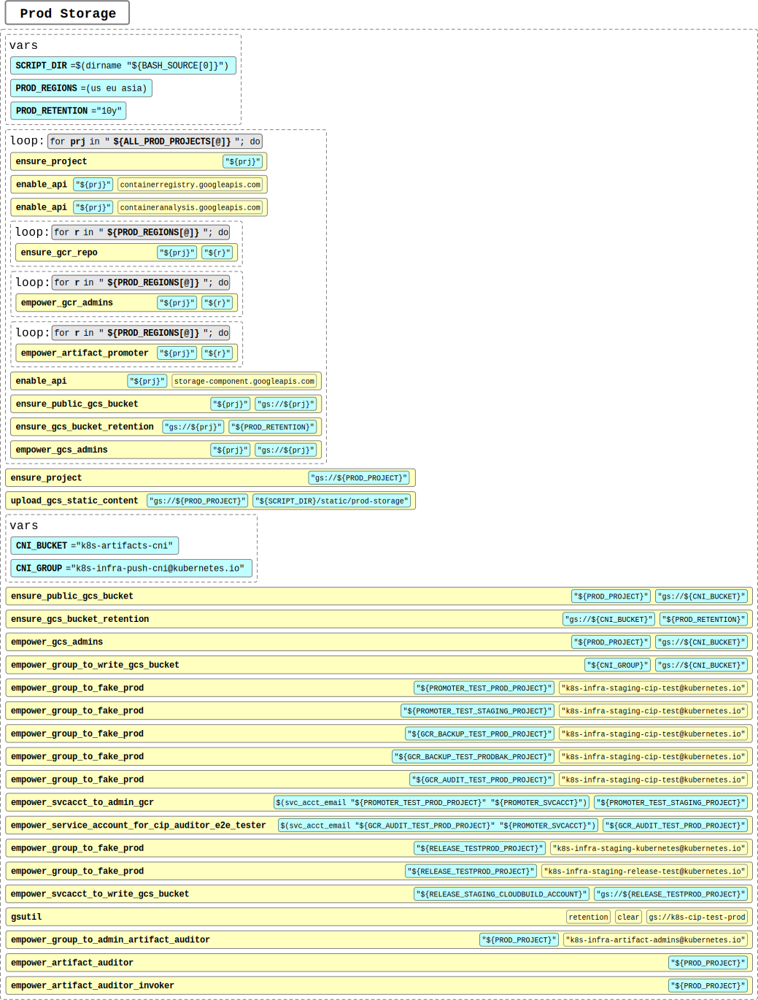

# Prod Storage <!-- omit in toc -->

Analyzed script: [ensure-prod-storage.sh](https://github.com/kubernetes/k8s.io/blob/e62c18e79a75615d4868afaf5eebcf36bb265df9/infra/gcp/ensure-prod-storage.sh)

---

## Table of Content <!-- omit in toc -->

- [Flow Chart](#flow-chart)
- [Terraform resources](#terraform-resources)
- [Variables used in Components](#variables-used-in-components)
- [Components](#components)
- [Yaml representation of Components](#yaml-representation-of-componentsg1g2)
- [Notes](#notes)
- [Reference](#reference)

## Flow Chart



## Terraform resources

- Provider: [`Google`](https://www.terraform.io/docs/providers/google/index.html "Provider: Google")
  - [`google_project`](https://www.terraform.io/docs/providers/google/r/google_project.html "Resource: Google Project")
  - [`google_project_service`](https://www.terraform.io/docs/providers/google/r/google_project_service.html "Resource: Google Project Service")
  - [`google_container_registry`](https://www.terraform.io/docs/providers/google/r/container_registry.html "Resource: Google Container Registry")
  - [`google_storage_bucket`](https://www.terraform.io/docs/providers/google/r/storage_bucket.html "Resource: Google Storage Bucket")
  - [`google_service_account`](https://www.terraform.io/docs/providers/google/r/google_service_account.html "Resource: Google Service Account")
  - [`google_storage_bucket_object`](https://www.terraform.io/docs/providers/google/r/storage_bucket_object.html "Resource: Google Storage Bucket Object")
  - [`google_project_iam_binding`](https://www.terraform.io/docs/providers/google/r/google_project_iam.html "Resource: Google Project IAM Binding")
  - [`google_project_iam_member`](https://www.terraform.io/docs/providers/google/r/google_project_iam.html "Resource: Google Project IAM Member")[<sup>G2</sup>](../README.md#global-reference)
  - [`google_storage_bucket_iam_binding`](https://www.terraform.io/docs/providers/google/r/storage_bucket_iam.html "Resource: Google Storage Bucket IAM Binding")
  - [`google_storage_bucket_iam_member`](https://www.terraform.io/docs/providers/google/r/storage_bucket_iam.html "Resource: Google Storage Bucket IAM Member")[<sup>G2</sup>](../README.md#global-reference)
  - [`google_service_account_iam_binding`](https://www.terraform.io/docs/providers/google/r/google_service_account_iam.html "Resource: Google Service Account IAM Binding")
  - [`google_service_account_iam_member`](https://www.terraform.io/docs/providers/google/r/google_service_account_iam.html "Resource: Google Service Account IAM Member")[<sup>G2</sup>](../README.md#global-reference)
  - [`google_cloud_run_service_iam_binding`](https://www.terraform.io/docs/providers/google/r/cloud_run_service_iam.html "Resource: Google Cloud Run Service IAM Binding")
  - [`google_cloud_run_service_iam_member`](https://www.terraform.io/docs/providers/google/r/cloud_run_service_iam.html "Resource: Google Cloud Run Service IAM Member")[<sup>G2</sup>](../README.md#global-reference)

## Variables used in Components

**`[PROJECTS]`**:

- `k8s-artifacts-prod`
- `k8s-artifacts-prod-bak`
- `k8s-cip-test-prod`
- `k8s-staging-cip-test`
- `k8s-gcr-backup-test-prod`
- `k8s-gcr-backup-test-prod-bak`
- `k8s-gcr-audit-test-prod`
- `k8s-release-test-prod`

**`[REGIONS]`**:

- `us`
- `eu`
- `asia`

## Components

- **Components per [`[PROJECT]`](#projects)**:
  - Project:
    - `[PROJECT]`
  - API:
    - `containerregistry`
    - `containeranalysis`
    - `storage-component`
  - GCS Bucket:
    - `gs://[PROJECT]`:
      - bucketpolicyonly: `true`
      - retention: `10y`
      - location: `us`
  - IAM:
    - `gs://[PROJECT]`:
      - `allUsers:objectViewer`
      - `group:k8s-infra-artifact-admins@kubernetes.io:objectAdmin`
      - `group:k8s-infra-artifact-admins@kubernetes.io:legacyBucketOwner`
  - IAM Policy Binding:
    - `roles/viewer`:
      - `group:k8s-infra-artifact-admins@kubernetes.io`
  - IAM Service Account:
    - `k8s-infra-gcr-promoter`:
      - display_name: `k8s-infra container image promoter`

  - **Components per [`[PROJECT]`](#projects) per [`[REGION]`](#regions)**:

    > [**Hint**]: Currently regions we are creating our resources at are: "`us`", "`eu`", "`asia`". So if you see for example GCR Resource with the name `[REGION]_[PROJECT]` for the project `k8s-artifacts-prod` (which we use for this example purposes) there will be three cloud registries (GCR) created: `us_k8s-artifacts-prod`, `eu_k8s-artifacts-prod` and `asia_k8s-artifacts-prod`

    - GCR:
      - `[REGION]_[PROJECT]`
    - GCS Bucket:
      - `gs://[REGION].artifacts.[PROJECT].appspot.com`:
        - bucketpolicyonly: `true`
    - IAM:
      - `gs://[REGION].artifacts.[PROJECT].appspot.com`:
        - `allUsers:objectViewer`
        - `group:k8s-infra-artifact-admins@kubernetes.io:objectAdmin`
        - `group:k8s-infra-artifact-admins@kubernetes.io:legacyBucketOwner`
        - `serviceAccount:k8s-infra-gcr-promoter@[PROJECT].iam.gserviceaccount.com:objectAdmin`
        - `serviceAccount:k8s-infra-gcr-promoter@[PROJECT].iam.gserviceaccount.com:legacyBucketOwner`

- **Additional components for project: `k8s-artifacts-prod`**:
  - GCS Bucket:
    - `gs://k8s-artifacts-prod`:
      - website[<sup>1</sup>](#reference "Special case"):
        - main_page_suffix: `index.html`
    - `gs://k8s-artifacts-cni`[<sup>2</sup>](#reference "Special case"):
      - location: `us`
      - bucketpolicyonly: `true`
      - retention: `10y`
  - IAM:
    - `gs://k8s-artifacts-cni`[<sup>2</sup>](#reference "Special case"):
      - `allUsers:objectViewer`
      - `group:k8s-infra-artifact-admins@kubernetes.io:objectAdmin`
      - `group:k8s-infra-artifact-admins@kubernetes.io:legacyBucketOwner`
      - `group:k8s-infra-push-cni@kubernetes.io:objectAdmin`
      - `group:k8s-infra-push-cni@kubernetes.io:legacyBucketReader`
  - IAM Policy Binding:
    - `roles/run.admin`[<sup>10</sup>](#reference "Special case"):
      - `group:k8s-infra-artifact-admins@kubernetes.io`
    - `roles/serviceusage.serviceUsageConsumer`[<sup>10</sup>](#reference "Special case"):
      - `group:k8s-infra-artifact-admins@kubernetes.io`
    - `roles/logging.logWriter`[<sup>11</sup>](#reference "Special case"):
      - `serviceAccount:k8s-infra-gcr-auditor@k8s-artifacts-prod.iam.gserviceaccount.com`
    - `roles/errorreporting.writer`[<sup>11</sup>](#reference "Special case"):
      - `serviceAccount:k8s-infra-gcr-auditor@k8s-artifacts-prod.iam.gserviceaccount.com`
  - IAM Policy Binding for Service Account[<sup>10</sup>](#reference "Special case"):
    - `k8s-infra-gcr-auditor@k8s-artifacts-prod.iam.gserviceaccount.com`:
      - role: `roles/iam.serviceAccountUser`
      - members:
        - `group:k8s-infra-artifact-admins@kubernetes.io`
  - IAM Service Account[<sup>11</sup>](#reference "Special case"):
    - `k8s-infra-gcr-auditor`:
      - project: `k8s-artifacts-prod`
      - display_name: `k8s-infra container image auditor`
    - `k8s-infra-gcr-auditor-invoker`:
      - project: `k8s-artifacts-prod`
      - display_name: `k8s-infra container image auditor invoker`
  - Cloud Run Service IAM Policy Binding[<sup>11</sup>](#reference "Special case"):
    - `cip-auditor`:
      - members:
        - `serviceAccount:k8s-infra-gcr-auditor-invoker@k8s-artifacts-prod.iam.gserviceaccount.com`
      - role: `roles/run.invoker`
      - platform: `managed`
      - project: `k8s-artifacts-prod`
      - region: `us-central1`

  - **Components per `[FILE]` in `[MODULE_PATH]/static/prod-storage` directory**[<sup>3</sup>](#reference "Special case")<sup>,</sup>[<sup>4</sup>](#reference "Example of how to achieve it with Terraform"):
    - GCS Bucket Object:
      - name: `[FILE]`
      - source: `[MODULE_PATH]/static/prod-storage/[FILE]`
      - bucket: `gs://k8s-artifacts-prod`

- **Components for project: `k8s-cip-test-prod`**[<sup>5</sup>](#reference "Special case"):
  - IAM Policy Binding:
    - `roles/viewer`:
      - `group:k8s-infra-staging-cip-test@kubernetes.io`
  
  - **Components for project: `k8s-cip-test-prod` per [`[REGION]`](#prod-storage-regions)**:
    - IAM:
      - `gs://[REGION].artifacts.k8s-cip-test-prod.appspot.com`:
        - `group:k8s-infra-staging-cip-test@kubernetes.io:objectAdmin`
        - `group:k8s-infra-staging-cip-test@kubernetes.io:legacyBucketOwner`

- **Components for project: `k8s-staging-cip-test`**[<sup>5</sup>](#reference "Special case"):
  - IAM Policy Binding:
    - `roles/viewer`:
      - `group:k8s-infra-staging-cip-test@kubernetes.io`
  - IAM[<sup>6</sup>](#reference "Special case"):
    - `gs://artifacts.k8s-staging-cip-test.appspot.com`
      - `serviceAccount:k8s-infra-gcr-promoter@k8s-cip-test-prod.iam.gserviceaccount.com:objectAdmin`
      - `serviceAccount:k8s-infra-gcr-promoter@k8s-cip-test-prod.iam.gserviceaccount.com:legacyBucketOwner`

  - **Components for project: `k8s-staging-cip-test` per [`[REGION]`](#prod-storage-regions)**:
    - IAM:
      - `gs://[REGION].artifacts.k8s-staging-cip-test.appspot.com`:
        - `group:k8s-infra-staging-cip-test@kubernetes.io:objectAdmin`
        - `group:k8s-infra-staging-cip-test@kubernetes.io:legacyBucketOwner`

- **Components for project: `k8s-gcr-backup-test-prod`**[<sup>5</sup>](#reference "Special case"):
  - IAM Policy Binding:
    - `roles/viewer`:
      - `group:k8s-infra-staging-cip-test@kubernetes.io`
  
  - **Components for project: `k8s-gcr-backup-test-prod` per [`[REGION]`](#prod-storage-regions)**:
    - IAM:
      - `gs://[REGION].artifacts.k8s-gcr-backup-test-prod.appspot.com`:
        - `group:k8s-infra-staging-cip-test@kubernetes.io:objectAdmin`
        - `group:k8s-infra-staging-cip-test@kubernetes.io:legacyBucketOwner`

- **Components for project: `k8s-gcr-backup-test-prod-bak`**[<sup>5</sup>](#reference "Special case"):
  - IAM Policy Binding:
    - `roles/viewer`:
      - `group:k8s-infra-staging-cip-test@kubernetes.io`
  
  - **Components for project: `k8s-gcr-backup-test-prod-bak` per [`[REGION]`](#prod-storage-regions)**:
    - IAM:
      - `gs://[REGION].artifacts.k8s-gcr-backup-test-prod-bak.appspot.com`:
        - `group:k8s-infra-staging-cip-test@kubernetes.io:objectAdmin`
        - `group:k8s-infra-staging-cip-test@kubernetes.io:legacyBucketOwner`

- **Components for project: `k8s-gcr-audit-test-prod`**[<sup>5</sup>](#reference "Special case"):
  - IAM Policy Binding[<sup>12</sup>](#reference "Found inconsistency"):
    - `roles/viewer`:
      - `group:k8s-infra-staging-cip-test@kubernetes.io`
    - `roles/errorreporting.admin`[<sup>7</sup>](#reference "Special case")
      - `serviceAccount:k8s-infra-gcr-promoter@k8s-gcr-audit-test-prod.iam.gserviceaccount.com`
    - `roles/logging.admin`[<sup>7</sup>](#reference "Special case")
      - `serviceAccount:k8s-infra-gcr-promoter@k8s-gcr-audit-test-prod.iam.gserviceaccount.com`
    - `roles/pubsub.admin`[<sup>7</sup>](#reference "Special case")
      - `serviceAccount:k8s-infra-gcr-promoter@k8s-gcr-audit-test-prod.iam.gserviceaccount.com`
    - `roles/resourcemanager.projectIamAdmin`[<sup>7</sup>](#reference "Special case")
      - `serviceAccount:k8s-infra-gcr-promoter@k8s-gcr-audit-test-prod.iam.gserviceaccount.com`
    - `roles/run.admin`[<sup>7</sup>](#reference "Special case")
      - `serviceAccount:k8s-infra-gcr-promoter@k8s-gcr-audit-test-prod.iam.gserviceaccount.com`
    - `roles/serverless.serviceAgent`[<sup>7</sup>](#reference "Special case")
      - `serviceAccount:k8s-infra-gcr-promoter@k8s-gcr-audit-test-prod.iam.gserviceaccount.com`
    - `roles/storage.admin`[<sup>7</sup>](#reference "Special case")
      - `serviceAccount:k8s-infra-gcr-promoter@k8s-gcr-audit-test-prod.iam.gserviceaccount.com`
  
  - **Components for project: `k8s-gcr-audit-test-prod` per [`[REGION]`](#prod-storage-regions)**:
    - IAM:
      - `gs://[REGION].artifacts.k8s-gcr-audit-test-prod.appspot.com`:
        - `group:k8s-infra-staging-cip-test@kubernetes.io:objectAdmin`
        - `group:k8s-infra-staging-cip-test@kubernetes.io:legacyBucketOwner`

- **Components for project: `k8s-release-test-prod`**[<sup>8</sup>](#reference "Special case"):
  - IAM Policy Binding:
    - `roles/viewer`:
      - `group:k8s-infra-staging-kubernetes@kubernetes.io`
      - `group:k8s-infra-staging-release-test@kubernetes.io`
  - IAM:
    - `gs://k8s-release-test-prod`[<sup>9</sup>](#reference "Special case"):
      - `serviceAccount:615281671549@cloudbuild.gserviceaccount.com:objectAdmin`
      - `serviceAccount:615281671549@cloudbuild.gserviceaccount.com:legacyBucketReader`
  
  - **Components for project: `k8s-release-test-prod` per [`[REGION]`](#prod-storage-regions)**:
    - IAM:
      - `gs://[REGION].artifacts.k8s-release-test-prod.appspot.com`:
        - `group:k8s-infra-staging-kubernetes@kubernetes.io:objectAdmin`
        - `group:k8s-infra-staging-kubernetes@kubernetes.io:legacyBucketOwner`
        - `group:k8s-infra-staging-release-test@kubernetes.io:objectAdmin`
        - `group:k8s-infra-staging-release-test@kubernetes.io:legacyBucketOwner`

## Yaml representation of Components[<sup>G1</sup>](../README.md#global-reference)<sup>,</sup>[<sup>G2</sup>](../README.md#global-reference)

```yaml
# [PROJECTS]
#   - k8s-artifacts-prod
#   - k8s-artifacts-prod-bak
#   - k8s-cip-test-prod
#   - k8s-staging-cip-test
#   - k8s-gcr-backup-test-prod
#   - k8s-gcr-backup-test-prod-bak
#   - k8s-gcr-audit-test-prod
#   - k8s-release-test-prod
#
# [REGIONS]
#
#   - us
#   - eu
#   - asia

google_project:
  - name: "[PROJECT]"
google_project_service:
  - service: containerregistry.googleapis.com
    project: "[PROJECT]"
  - service: containeranalysis.googleapis.com
    project: "[PROJECT]"
  - service: storage-component.googleapis.com
    project: "[PROJECT]"
google_container_registry:
  project: "[REGION]_[PROJECT]"
google_storage_bucket:
  - name: "[PROJECT]"
    bucket_policy_only: true
    location: us
    retention_policy:
      retention_period: 315360000 # 10 years
  - name: "[REGION].artifacts.[PROJECT].appspot.com"
    bucket_policy_only: true
  # START: Additional components for project: "k8s-artifacts-prod"
  - name: k8s-artifacts-prod
    website:
      main_page_suffix: index.html
    project: k8s-artifacts-prod
  - name: k8s-artifacts-cni
    location: us
    bucket_policy_only: true
    retention_policy:
      retention_period: 315360000 # 10 years
    project: k8s-artifacts-prod
  # END
google_project_iam_binding:
  - role: roles/viewer
    members:
      - group:k8s-infra-artifact-admins@kubernetes.io
    project: "[PROJECT]"
  # START: Additional components for project: "k8s-artifacts-prod"
  - role: roles/run.admin
    members:
      - group:k8s-infra-artifact-admins@kubernetes.io
    project: k8s-artifacts-prod
  - role: roles/serviceusage.serviceUsageConsumer
    members:
      - group:k8s-infra-artifact-admins@kubernetes.io
    project: k8s-artifacts-prod
  - role: roles/logging.logWriter
    members:
      - serviceAccount:k8s-infra-gcr-auditor@k8s-artifacts-prod.iam.gserviceaccount.com
    project: k8s-artifacts-prod
  - role: roles/errorreporting.writer
    members:
      - serviceAccount:k8s-infra-gcr-auditor@k8s-artifacts-prod.iam.gserviceaccount.com
    project: k8s-artifacts-prod
  # END
  # START: Additional components for project: "k8s-cip-test-prod"
  - role: roles/viewer
    members:
      - group:k8s-infra-staging-cip-test@kubernetes.io
    project: k8s-cip-test-prod
  # END
  # START: Additional components for project: "k8s-staging-cip-test"
  - role: roles/viewer
    members:
      - group:k8s-infra-staging-cip-test@kubernetes.io
    project: k8s-staging-cip-test
  # END
  # START: Additional components for project: "k8s-gcr-backup-test-prod"
  - role: roles/viewer
    members:
      - group:k8s-infra-staging-cip-test@kubernetes.io
    project: k8s-gcr-backup-test-prod
  # END
  # START: Additional components for project: "k8s-gcr-backup-test-prod-bak"
  - role: roles/viewer
    members:
      - group:k8s-infra-staging-cip-test@kubernetes.io
    project: k8s-gcr-backup-test-prod-bak
  # END
  # START: Additional components for project: "k8s-gcr-audit-test-prod"
  - role: roles/viewer
    members:
      - group:k8s-infra-staging-cip-test@kubernetes.io
    project: k8s-gcr-audit-test-prod
  - role: roles/errorreporting.admin
    members:
      - serviceAccount:k8s-infra-gcr-promoter@k8s-gcr-audit-test-prod.iam.gserviceaccount.com
    project: k8s-gcr-audit-test-prod
  - role: roles/logging.admin
    members:
      - serviceAccount:k8s-infra-gcr-promoter@k8s-gcr-audit-test-prod.iam.gserviceaccount.com
    project: k8s-gcr-audit-test-prod
  - role: roles/pubsub.admin
    members:
      - serviceAccount:k8s-infra-gcr-promoter@k8s-gcr-audit-test-prod.iam.gserviceaccount.com
    project: k8s-gcr-audit-test-prod
  - role: roles/resourcemanager.projectIamAdmin
    members:
      - serviceAccount:k8s-infra-gcr-promoter@k8s-gcr-audit-test-prod.iam.gserviceaccount.com
    project: k8s-gcr-audit-test-prod
  - role: roles/run.admin
    members:
      - serviceAccount:k8s-infra-gcr-promoter@k8s-gcr-audit-test-prod.iam.gserviceaccount.com
    project: k8s-gcr-audit-test-prod
  - role: roles/serverless.serviceAgent
    members:
      - serviceAccount:k8s-infra-gcr-promoter@k8s-gcr-audit-test-prod.iam.gserviceaccount.com
    project: k8s-gcr-audit-test-prod
  - role: roles/storage.admin
    members:
      - serviceAccount:k8s-infra-gcr-promoter@k8s-gcr-audit-test-prod.iam.gserviceaccount.com
    project: k8s-gcr-audit-test-prod
  # END
  # START: Additional components for project: "k8s-release-test-prod"
  - role: roles/viewer
    members:
      - group:k8s-infra-staging-kubernetes@kubernetes.io
      - group:k8s-infra-staging-release-test@kubernetes.io
    project: k8s-release-test-prod
  # END
# START: Additional components for project: "k8s-artifacts-prod"
google_service_account:
  - account_id: k8s-infra-gcr-auditor
    display_name: k8s-infra container image auditor
    project: k8s-artifacts-prod
  - account_id: k8s-infra-gcr-auditor-invoker
    display_name: k8s-infra container image auditor invoker
    project: k8s-artifacts-prod
google_service_account_iam_binding:
  - service_account_id: k8s-infra-gcr-auditor@k8s-artifacts-prod.iam.gserviceaccount.com
    role: roles/iam.serviceAccountUser
    members:
      - group:k8s-infra-artifact-admins@kubernetes.io
google_cloud_run_service_iam_binding:
  service_name: cip-auditor
  role: roles/run.invoker
  members:
    - serviceAccount:k8s-infra-gcr-auditor-invoker@k8s-artifacts-prod.iam.gserviceaccount.com
  location: us-central1
  project: k8s-artifacts-prod
google_storage_bucket_object:
# We'll be copying all static files from "static/prod-storage"
  - name: "[NAME]"
    source: "[MODULE_PATH]/static/prod-storage/[FILE]"
    bucket: gs://k8s-artifacts-prod
# END
google_storage_bucket_iam_binding:
  # gs://[PROJECT]
  - role: roles/storage.objectViewer
    members:
      - allUsers
    bucket: gs://[PROJECT]
  - role: roles/storage.objectAdmin
    members:
      - group:k8s-infra-artifact-admins@kubernetes.io
    bucket: gs://[PROJECT]
  - role: roles/storage.legacyBucketOwner
    members:
      - group:k8s-infra-artifact-admins@kubernetes.io
    bucket: gs://[PROJECT]
  # gs://[REGION].artifacts.[PROJECT].appspot.com
  - role: roles/storage.objectViewer
    members:
      - allUsers
    bucket: gs://[REGION].artifacts.[PROJECT].appspot.com
  - role: roles/storage.objectAdmin
    members:
      - group:k8s-infra-artifact-admins@kubernetes.io
      - serviceAccount:k8s-infra-gcr-promoter@[PROJECT].iam.gserviceaccount.com
    bucket: gs://[REGION].artifacts.[PROJECT].appspot.com
  - role: roles/storage.legacyBucketOwner
    members:
      - group:k8s-infra-artifact-admins@kubernetes.io
      - serviceAccount:k8s-infra-gcr-promoter@[PROJECT].iam.gserviceaccount.com
    bucket: gs://[REGION].artifacts.[PROJECT].appspot.com
  # gs://k8s-artifacts-cni
  # START: Additional components for project: "k8s-artifacts-prod"
  - role: roles/storage.objectViewer
    members:
      - allUsers
    bucket: gs://k8s-artifacts-cni
  - role: roles/storage.objectAdmin
    members:
      - group:k8s-infra-artifact-admins@kubernetes.io
      - group:k8s-infra-push-cni@kubernetes.io
    bucket: gs://k8s-artifacts-cni
  - role: roles/storage.legacyBucketOwner
    members:
      - group:k8s-infra-artifact-admins@kubernetes.io
    bucket: gs://k8s-artifacts-cni
  - role: roles/storage.legacyBucketReader
    members:
      - group:k8s-infra-push-cni@kubernetes.io
    bucket: gs://k8s-artifacts-cni
  # END
  # START: Additional components for project: "k8s-cip-test-prod"
  - role: roles/storage.objectAdmin
    members:
      - group:k8s-infra-staging-cip-test@kubernetes.io
    bucket: gs://[REGION].artifacts.k8s-cip-test-prod.appspot.com
  - role: roles/storage.legacyBucketOwner
    members:
      - group:k8s-infra-staging-cip-test@kubernetes.io
    bucket: gs://[REGION].artifacts.k8s-cip-test-prod.appspot.com
  # END
  # START: Additional components for project: "k8s-staging-cip-test"
  - role: roles/storage.objectAdmin
    members:
      - serviceAccount:k8s-infra-gcr-promoter@k8s-cip-test-prod.iam.gserviceaccount.com
    bucket: gs://artifacts.k8s-staging-cip-test.appspot.com
  - role: roles/storage.legacyBucketOwner
    members:
      - serviceAccount:k8s-infra-gcr-promoter@k8s-cip-test-prod.iam.gserviceaccount.com
    bucket: gs://artifacts.k8s-staging-cip-test.appspot.com
  - role: roles/storage.objectAdmin
    members:
      - group:k8s-infra-staging-cip-test@kubernetes.io
    bucket: gs://[REGION].artifacts.k8s-staging-cip-test.appspot.com
  - role: roles/storage.legacyBucketOwner
    members:
      - group:k8s-infra-staging-cip-test@kubernetes.io
    bucket: gs://[REGION].artifacts.k8s-staging-cip-test.appspot.com
  # END
  # START: Additional components for project: "k8s-gcr-backup-test-prod"
  - role: roles/storage.objectAdmin
    members:
      - group:k8s-infra-staging-cip-test@kubernetes.io
    bucket: gs://[REGION].artifacts.k8s-gcr-backup-test-prod.appspot.com
  - role: roles/storage.legacyBucketOwner
    members:
      - group:k8s-infra-staging-cip-test@kubernetes.io
    bucket: gs://[REGION].artifacts.k8s-gcr-backup-test-prod.appspot.com
  # END
  # START: Additional components for project: "k8s-gcr-backup-test-prod-bak"
  - role: roles/storage.objectAdmin
    members:
      - group:k8s-infra-staging-cip-test@kubernetes.io
    bucket: gs://[REGION].artifacts.k8s-gcr-backup-test-prod-bak.appspot.com
  - role: roles/storage.legacyBucketOwner
    members:
      - group:k8s-infra-staging-cip-test@kubernetes.io
    bucket: gs://[REGION].artifacts.k8s-gcr-backup-test-prod-bak.appspot.com
  # END
  # START: Additional components for project: "k8s-gcr-audit-test-prod"
  - role: roles/storage.objectAdmin
    members:
      - group:k8s-infra-staging-cip-test@kubernetes.io
    bucket: gs://[REGION].artifacts.k8s-gcr-audit-test-prod.appspot.com
  - role: roles/storage.legacyBucketOwner
    members:
      - group:k8s-infra-staging-cip-test@kubernetes.io
    bucket: gs://[REGION].artifacts.k8s-gcr-audit-test-prod.appspot.com
  # END
  # START: Additional components for project: "k8s-release-test-prod"
  - role: roles/storage.objectAdmin
    members:
      - serviceAccount:615281671549@cloudbuild.gserviceaccount.com
    bucket: gs://k8s-release-test-prod
  - role: roles/storage.legacyBucketOwner
    members:
      - serviceAccount:615281671549@cloudbuild.gserviceaccount.com
    bucket: gs://k8s-release-test-prod
  - role: roles/storage.objectAdmin
    members:
      - group:k8s-infra-staging-kubernetes@kubernetes.io
      - group:k8s-infra-staging-release-test@kubernetes.io
    bucket: gs://[REGION].artifacts.k8s-release-test-prod.appspot.com
  - role: roles/storage.legacyBucketOwner
    members:
      - group:k8s-infra-staging-kubernetes@kubernetes.io
      - group:k8s-infra-staging-release-test@kubernetes.io
    bucket: gs://[REGION].artifacts.k8s-release-test-prod.appspot.com
  # END
```

## Notes

- As we can see here is a lot of special cases. By nature of bash, whole process of provisioning components is procedural, so for purposes of not repeating themselves, creators of this script are first iterating over all prod projects and provisioning components which are common for each of them and then if there are still components which need to be provisioned (special cases) for some of the projects they are doing it. We need to find a better way for doing it when using terraform.
- At [line 212](https://github.com/kubernetes/k8s.io/blob/master/infra/gcp/ensure-prod-storage.sh#L211-L212) we are removing retention from `gs://k8s-cip-test-prod` - think about how to be able to doesn't need to explicitly remove settings which were earlier also set by us. It also means.
- ^ ***THIS CHANGE (REMOVING RETENTION) IS NOT REFLECTED AT LIST OF COMPONENTS ABOVE*** - it's because currently I'm representing all components the same way as it's done at existing scripts (first iterating over all projects with common components and then iterating again for special cases) and when we'll decide to use that components list to create terraform configurations it will be problematic, because declarative approach by nature won't have problem with firstly assigning some property and then removing it because we'll just describe the state of infrastructure we want to achieve - not the steps.

## Reference

- <sup>1</sup> [Special case: `ensure-prod-storage.sh#L139`](https://github.com/kubernetes/k8s.io/blob/master/infra/gcp/ensure-prod-storage.sh#L139)
- <sup>2</sup> [Special case: `ensure-prod-storage.sh#L149`](https://github.com/kubernetes/k8s.io/blob/master/infra/gcp/ensure-prod-storage.sh#L149)
- <sup>3</sup> [Special case: `ensure-prod-storage.sh#L143`](https://github.com/kubernetes/k8s.io/blob/master/infra/gcp/ensure-prod-storage.sh#L143)
- <sup>4</sup> Example of how to recursively upload files from directory

  > [**todo(@bartsmykla)**]: Verify it works

  ```terraform
  variable statics_path {
    default = "${path.module}/static/prod-storage"
  }

  resource "google_storage_bucket_object" "prod_storage_statics" {
    for_each = fileset(var.statics_path, "**")
    name     = each.value
    source   = "${var.statics_path}/${each.value}"
  }
  ```

- <sup>5</sup> [Special case: `ensure-prod-storage.sh#L163-L164`](https://github.com/kubernetes/k8s.io/blob/master/infra/gcp/ensure-prod-storage.sh#L163-L164)
- <sup>6</sup> [Special case: `ensure-prod-storage.sh#L181-L182`](https://github.com/kubernetes/k8s.io/blob/master/infra/gcp/ensure-prod-storage.sh#L181-L182)
- <sup>7</sup> [Special case: `ensure-prod-storage.sh#L187-L189`](https://github.com/kubernetes/k8s.io/blob/master/infra/gcp/ensure-prod-storage.sh#L187-L189)
- <sup>8</sup> [Special case: `ensure-prod-storage.sh#L194-L195`](https://github.com/kubernetes/k8s.io/blob/master/infra/gcp/ensure-prod-storage.sh#L194-L195)
- <sup>9</sup> [Special case: `ensure-prod-storage.sh#L204-L206`](https://github.com/kubernetes/k8s.io/blob/master/infra/gcp/ensure-prod-storage.sh#L204-L206)
- <sup>10</sup> [Special case: `ensure-prod-storage.sh#L214-L215`](https://github.com/kubernetes/k8s.io/blob/master/infra/gcp/ensure-prod-storage.sh#L214-L215)
- <sup>11</sup> [Special case: `ensure-prod-storage.sh#L219`](https://github.com/kubernetes/k8s.io/blob/master/infra/gcp/ensure-prod-storage.sh#L219)
- <sup>12</sup>[**todo(@bartsmykla)**]: When doing analysis of CIP Auditor scripts I found that [IAMs for `k8s-gcr-audit-test-prod`](https://github.com/kubernetes/k8s.io/blob/e62c18e79a75615d4868afaf5eebcf36bb265df9/audit/projects/k8s-gcr-audit-test-prod/iam.json) doesn't match exactly with those assigned by our scripts. I need to compare them more precisely

## IAMs analysis

### Legend

| Icon | Description                                                                                                                          |
|:----:|:-------------------------------------------------------------------------------------------------------------------------------------|
|  🔴  | Assigning the IAM not found in any script from [`k/k8s.io/infra/gcp/`][L1]                                                           |
|  🟠  | Not found direct assigning of the IAM, but it was **probably** assigned implicitly (links should be provided to show by who or what) |
|  🟢  | Assigning the IAM found in one of the scripts                                                                                        |

### [`k8s-artifacts-prod`](https://github.com/kubernetes/k8s.io/blob/e62c18e79a75615d4868afaf5eebcf36bb265df9/audit/projects/k8s-artifacts-prod/iam.json)

| Status | Role                                   | Member                                                                                    | Description                   |
|:------:|:---------------------------------------|:------------------------------------------------------------------------------------------|:------------------------------|
|        | `roles/compute.serviceAgent`           | `serviceAccount:service-388270116193@compute-system.iam.gserviceaccount.com`              |                               |
|        | `roles/containeranalysis.ServiceAgent` | `serviceAccount:service-388270116193@container-analysis.iam.gserviceaccount.com`          |                               |
|        | `roles/containerscanning.ServiceAgent` | `serviceAccount:service-388270116193@gcp-sa-containerscanning.iam.gserviceaccount.com`    |                               |
|        | `roles/editor`                         | `serviceAccount:388270116193-compute@developer.gserviceaccount.com`                       |                               |
|        | `roles/editor`                         | `serviceAccount:388270116193@cloudservices.gserviceaccount.com`                           |                               |
|        | `roles/editor`                         | `serviceAccount:service-388270116193@containerregistry.iam.gserviceaccount.com`           |                               |
|   🔴   | `roles/editor`                         | `user:justinsb@google.com`                                                                |                               |
|        | `roles/errorreporting.writer`          | `serviceAccount:k8s-infra-gcr-auditor@k8s-artifacts-prod.iam.gserviceaccount.com`         |                               |
|        | `roles/logging.logWriter`              | `serviceAccount:k8s-infra-gcr-auditor@k8s-artifacts-prod.iam.gserviceaccount.com`         |                               |
|   🔴   | `roles/owner`                          | `user:thockin@google.com`                                                                 |                               |
|        | `roles/run.admin`                      | `group:k8s-infra-artifact-admins@kubernetes.io`                                           |                               |
|        | `roles/run.invoker`                    | `serviceAccount:k8s-infra-gcr-auditor-invoker@k8s-artifacts-prod.iam.gserviceaccount.com` |                               |
|        | `roles/run.serviceAgent`               | `serviceAccount:service-388270116193@serverless-robot-prod.iam.gserviceaccount.com`       |                               |
|   🟢   | `roles/viewer`                         | `group:k8s-infra-artifact-admins@kubernetes.io`                                           | [`ensure-prod-storage.sh`][1] |

[L1]: https://github.com/kubernetes/k8s.io/tree/e62c18e79a75615d4868afaf5eebcf36bb265df9/infra/gcp
[1]: https://github.com/kubernetes/k8s.io/blob/8e69cb5b6fea5ce4f8f9dd1f158ef4b5236de2e6/infra/gcp/ensure-prod-storage.sh#L117

## Questions & Doubts

- When I'm looking at bucket: [`gs://k8s-artifacts-prod`](https://console.cloud.google.com/storage/browser/k8s-artifacts-prod?forceOnBucketsSortingFiltering=false&authuser=0&folder=true&organizationId=true&project=k8s-artifacts-prod) the only things I see here are file: [index.html](https://github.com/kubernetes/k8s.io/blob/e62c18e79a75615d4868afaf5eebcf36bb265df9/infra/gcp/static/prod-storage/index.html) and directory: [`binaries/kops`](https://console.cloud.google.com/storage/browser/k8s-artifacts-prod/binaries/kops/?forceOnBucketsSortingFiltering=false&authuser=0&folder=true&organizationId=true&project=k8s-artifacts-prod)
  - Why there is only `kops` using it?
  - What is the purpose of this bucket?
  - As far as it follows from the code it looks like the only people who have access to push to that bucket are members of the group: `k8s-infra-artifact-admins@kubernetes.io`, what is the process to push to this bucket?
- Looking at bucket: [`gs://k8s-artifacts-prod-bak`](https://console.cloud.google.com/storage/browser/k8s-artifacts-prod-bak/binaries/kops/?forceOnBucketsSortingFiltering=false&authuser=0&folder=true&organizationId=true&project=k8s-artifacts-prod-bak) it seems it's empty
  - What is the purpose of the bucket?
  - Why it's empty?
  - What is the process of pushing to that bucket?
- [cc. @listx] What is the purpose of [fake_prod test projects](https://github.com/kubernetes/k8s.io/blob/e62c18e79a75615d4868afaf5eebcf36bb265df9/infra/gcp/ensure-prod-storage.sh#L162-L178)?
  - Looking at [`gs://k8s-cip-test-prod`](https://console.cloud.google.com/storage/browser/k8s-cip-test-prod?project=k8s-cip-test-prod&authuser=0&folder=true&organizationId=true) there is a bunch of binary files which are more than 6 months old
    - Are we using this bucket?
    - Who/What and when is pushing to this bucket?
  - [`gs://k8s-gcr-backup-test-prod`](https://console.cloud.google.com/storage/browser/k8s-gcr-backup-test-prod?project=k8s-gcr-backup-test-prod&authuser=0&folder=true&organizationId=true), [`gs://k8s-gcr-backup-test-prod-bak`](https://console.cloud.google.com/storage/browser/k8s-gcr-backup-test-prod-bak?project=k8s-gcr-backup-test-prod-bak&authuser=0&folder=true&organizationId=true), [`gs://k8s-gcr-audit-test-prod`](https://console.cloud.google.com/storage/browser/k8s-gcr-audit-test-prod?project=k8s-gcr-audit-test-prod&authuser=0&folder=true&organizationId=true) look empty
    - Are we using them?
    - Who/What and when is pushing to these buckets?
  - [cc. @justaugustus] There is some empty, recently created file at bucket [`gs://k8s-release-test-prod`](https://console.cloud.google.com/storage/browser/k8s-release-test-prod?project=k8s-release-test-prod&authuser=0&folder=true&organizationId=true)
    - What is the purpose of this bucket?
    - What is the process of pushing to that bucket?
