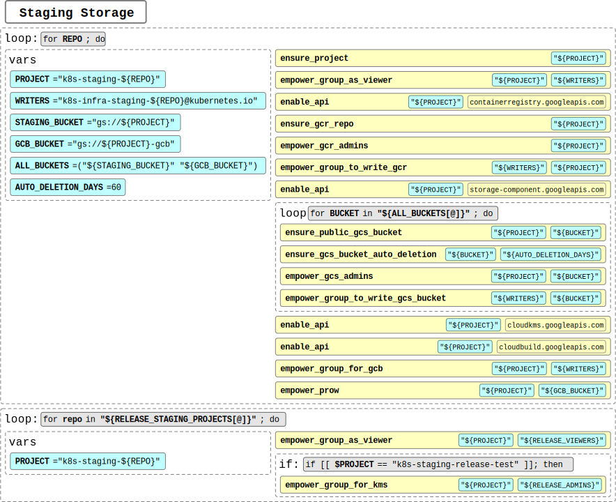

# Staging Storage <!-- omit in toc -->

Analyzed script: [ensure-staging-storage.sh](https://github.com/kubernetes/k8s.io/blob/e62c18e79a75615d4868afaf5eebcf36bb265df9/infra/gcp/ensure-staging-storage.sh)

---

## Table of Content <!-- omit in toc -->

- [Flow Chart](#flow-chart)
- [Terraform resources](#terraform-resources)
- [Variables used in Components](#variables-used-in-components)
- [Components](#components)
- [Yaml representation of Components](#yaml-representation-of-componentsg1g2)

## Flow Chart



---

## Terraform resources

- Provider: [`Google`](https://www.terraform.io/docs/providers/google/index.html "Provider: Google")
  - [`google_project`](https://www.terraform.io/docs/providers/google/r/google_project.html "Resource: Google Project")
  - [`google_project_service`](https://www.terraform.io/docs/providers/google/r/google_project_service.html "Resource: Google Project Service")
  - [`google_container_registry`](https://www.terraform.io/docs/providers/google/r/container_registry.html "Resource: Google Container Registry")
  - [`google_storage_bucket`](https://www.terraform.io/docs/providers/google/r/storage_bucket.html "Resource: Google Storage Bucket")
  - [`google_project_iam_binding`](https://www.terraform.io/docs/providers/google/r/google_project_iam.html "Resource: Google Project IAM Binding")
  - [`google_project_iam_member`](https://www.terraform.io/docs/providers/google/r/google_project_iam.html "Resource: Google Project IAM Member")[<sup>G2</sup>](../README.md#global-reference)
  - [`google_storage_bucket_iam_binding`](https://www.terraform.io/docs/providers/google/r/storage_bucket_iam.html "Resource: Google Storage Bucket IAM Binding")
  - [`google_storage_bucket_iam_member`](https://www.terraform.io/docs/providers/google/r/storage_bucket_iam.html "Resource: Google Storage Bucket IAM Member")[<sup>G2</sup>](../README.md#global-reference)
  - [`google_storage_bucket_acl`](https://www.terraform.io/docs/providers/google/r/storage_bucket_acl.html "Resource: Google Storage Bucket ACL")

## Variables used in Components

### `[PROJECTS]`

- `apisnoop`
- `artifact-promoter`
- `build-image`
- `cip-test`
- `cluster-api`
- `cluster-api-aws`
- `cluster-api-azure`
- `cluster-api-gcp`
- `capi-openstack`
- `capi-kubeadm`
- `capi-docker`
- `capi-vsphere`
- `coredns`
- `csi`
- `descheduler`
- `e2e-test-images`
- `external-dns`
- `kas-network-proxy`
- `kops`
- `kube-state-metrics`
- `kubeadm`
- `kubernetes`
- `metrics-server`
- `multitenancy`
- `nfd`
- `npd`
- `provider-azure`
- `publishing-bot`
- `release-test`
- `releng`
- `scl-image-builder`
- `service-apis`
- `txtdirect`

### `[RS_PROJECTS]`:

- `kubernetes`
- `release-test`
- `releng`

## Components

- **Components for [`[PROJECT]`](#projects)**:
  - Project `k8s-staging-[PROJECT]`:
    - organization: `758905017065`
    - billing_account: `018801-93540E-22A20E`
  - IAM Policy Binding:
    - `roles/viewer`:
      - `group:k8s-infra-staging-[PROJECT]@kubernetes.io`
      - `group:k8s-infra-artifact-admins@kubernetes.io`
    - `roles/cloudbuild.builds.editor`:
      - `group:k8s-infra-staging-[PROJECT]@kubernetes.io`
    - `roles/serviceusage.serviceUsageConsumer`:
      - `group:k8s-infra-staging-[PROJECT]@kubernetes.io`
    - `roles/cloudbuild.builds.builder`:
      - `serviceAccount:deployer@k8s-prow.iam.gserviceaccount.com`
  - GCR:
    - `k8s-staging-[PROJECT]`
  - IAM:
    - `gs://artifacts.k8s-staging-[PROJECT].appspot.com`:
      - `allUsers:objectViewer`
      - `group:k8s-infra-artifact-admins@kubernetes.io:objectAdmin`
      - `group:k8s-infra-artifact-admins@kubernetes.io:legacyBucketOwner`
      - `group:k8s-infra-staging-[PROJECT]@kubernetes.io:objectAdmin`
      - `group:k8s-infra-staging-[PROJECT]@kubernetes.io:legacyBucketReader`
    - `gs://k8s-staging-[PROJECT]`:
      - `allUsers:objectViewer`
      - `group:k8s-infra-artifact-admins@kubernetes.io:objectAdmin`
      - `group:k8s-infra-artifact-admins@kubernetes.io:legacyBucketOwner`
      - `group:k8s-infra-staging-[PROJECT]@kubernetes.io:objectAdmin`
      - `group:k8s-infra-staging-[PROJECT]@kubernetes.io:legacyBucketReader`
    - `gs://k8s-staging-[PROJECT]-gcb`:
      - `allUsers:objectViewer`
      - `group:k8s-infra-artifact-admins@kubernetes.io:objectAdmin`
      - `group:k8s-infra-artifact-admins@kubernetes.io:legacyBucketOwner`
      - `group:k8s-infra-staging-[PROJECT]@kubernetes.io:objectAdmin`
      - `group:k8s-infra-staging-[PROJECT]@kubernetes.io:legacyBucketReader`
      - `serviceAccount:deployer@k8s-prow.iam.gserviceaccount.com:objectCreator`
      - `serviceAccount:deployer@k8s-prow.iam.gserviceaccount.com:objectViewer`
  - API:
    - `containerregistry`
    - `storage-component`
    - `cloudkms`
    - `cloudbuild`
  - GCS Bucket:
    - `gs://k8s-staging-[PROJECT]`:
      - bucketpolicyonly: `true`
      - location: `us`
      - auto_deletion: `60 days`
    - `gs://k8s-staging-[PROJECT]-gcb`:
      - bucketpolicyonly: `true`
      - location: `us`
      - auto_deletion: `60 days`
    - `gs://artifacts.k8s-staging-[PROJECT].appspot.com`:
      - bucketpolicyonly: `true`

- **Components for [RELEASE_STAGING_PROJECTS `[RS_PROJECT]`](#rsprojects)**:

  > [@bartsmykla: I think it's not consistent to put resources for release projects here, even if they are release ones. I think there should be created separate place for it]

  - IAM Policy Binding:
    - `roles/viewer`:
      - `group:k8s-infra-release-viewers@kubernetes.io`

- **Components for project: `k8s-staging-release-test`**:

  - IAM Policy Binding:
    - `roles/cloudkms.admin`:
      - `group:k8s-infra-release-admins@kubernetes.io`
    - `roles/cloudkms.cryptoKeyEncrypterDecrypter`:
      - `group:k8s-infra-release-admins@kubernetes.io`

## Yaml representation of Components[<sup>G1</sup>](../README.md#global-reference),</sup>[<sup>G2</sup>](../README.md#global-reference)

```yaml
# [PROJECTS]:
#   - apisnoop
#   - artifact-promoter
#   - build-image
#   - cip-test
#   - cluster-api
#   - cluster-api-aws
#   - cluster-api-azure
#   - cluster-api-gcp
#   - capi-openstack
#   - capi-kubeadm
#   - capi-docker
#   - capi-vsphere
#   - coredns
#   - csi
#   - descheduler
#   - e2e-test-images
#   - external-dns
#   - kas-network-proxy
#   - kops
#   - kube-state-metrics
#   - kubeadm
#   - kubernetes
#   - metrics-server
#   - multitenancy
#   - nfd
#   - npd
#   - provider-azure
#   - publishing-bot
#   - release-test
#   - releng
#   - scl-image-builder
#   - service-apis
#   - txtdirect
#
# [RS_PROJECTS]:
#   - kubernetes
#   - release-test
#   - releng

google_project:
  - name: k8s-staging-[PROJECT]
    org_id: 758905017065
    billing_account: 018801-93540E-22A20E
google_project_service:
  - service: containerregistry.googleapis.com
    project: k8s-staging-[PROJECT]
  - service: storage-component.googleapis.com
    project: k8s-staging-[PROJECT]
  - service: cloudkms.googleapis.com
    project: k8s-staging-[PROJECT]
  - service: cloudbuild.googleapis.com
    project: k8s-staging-[PROJECT]
google_container_registry:
  project: k8s-staging-[PROJECT]
google_storage_bucket:
  - name: k8s-staging-[PROJECT]
    bucket_policy_only: true
    location: us
    retention_policy:
      retention_period: 5184000 # 60 days
  - name: k8s-staging-[PROJECT]-gcb
    bucket_policy_only: true
    location: us
    retention_policy:
      retention_period: 5184000 # 60 days
  - name: artifacts.k8s-staging-[PROJECT].appspot.com
    bucket_policy_only: true
google_project_iam_binding:
  - role: roles/viewer
    members:
      - group:k8s-infra-staging-[PROJECT]@kubernetes.io
      - group:k8s-infra-artifact-admins@kubernetes.io
    project: k8s-staging-[PROJECT]
  - role: roles/cloudbuild.builds.editor
    members:
      - group:k8s-infra-staging-[PROJECT]@kubernetes.io
    project: k8s-staging-[PROJECT]
  - role: roles/serviceusage.serviceUsageConsumer
    members:
      - group:k8s-infra-staging-[PROJECT]@kubernetes.io
    project: k8s-staging-[PROJECT]
  - role: roles/cloudbuild.builds.builder
    members:
      - serviceAccount:deployer@k8s-prow.iam.gserviceaccount.com
    project: k8s-staging-[PROJECT]
  # Additional components for [RS_PROJECTS]
  - role: roles/viewer
    members:
      - group:k8s-infra-release-viewers@kubernetes.io
    project: k8s-staging-[RS_PROJECTS]
  # Additional components for project: "k8s-staging-release-test"
  - role: roles/cloudkms.admin
    members:
      - group:k8s-infra-release-admins@kubernetes.io
    project: k8s-staging-release-test
  - role: roles/cloudkms.cryptoKeyEncrypterDecrypter
    members:
      - group:k8s-infra-release-admins@kubernetes.io
    project: k8s-staging-release-test
google_storage_bucket_iam_binding:
  # gs://artifacts.k8s-staging-[PROJECT].appspot.com
  - role: roles/storage.objectViewer
    members:
      - allUsers
    bucket: gs://artifacts.k8s-staging-[PROJECT].appspot.com
  - role: roles/storage.objectAdmin
    members:
      - group:k8s-infra-artifact-admins@kubernetes.io
      - group:k8s-infra-staging-[PROJECT]@kubernetes.io
    bucket: gs://artifacts.k8s-staging-[PROJECT].appspot.com
  - role: roles/storage.legacyBucketOwner
    members:
      - group:k8s-infra-release-admins@kubernetes.io
    bucket: gs://artifacts.k8s-staging-[PROJECT].appspot.com
  - role: roles/storage.legacyBucketReader
    members:
      - group:k8s-infra-staging-[PROJECT]@kubernetes.io
    bucket: gs://artifacts.k8s-staging-[PROJECT].appspot.com
  # gs://k8s-staging-[PROJECT]
  - role: roles/storage.objectViewer
    members:
      - allUsers
    bucket: gs://k8s-staging-[PROJECT]
  - role: roles/storage.objectAdmin
    members:
      - group:k8s-infra-artifact-admins@kubernetes.io
      - group:k8s-infra-staging-[PROJECT]@kubernetes.io
    bucket: gs://k8s-staging-[PROJECT]
  - role: roles/storage.legacyBucketOwner
    members:
      - group:k8s-infra-release-admins@kubernetes.io
    bucket: gs://k8s-staging-[PROJECT]
  - role: roles/storage.legacyBucketReader
    members:
      - group:k8s-infra-staging-[PROJECT]@kubernetes.io
    bucket: gs://k8s-staging-[PROJECT]
  # gs://k8s-staging-[PROJECT]-gcb
  #
  # IAM bindings differenciate "gs://k8s-staging-[PROJECT]-gcb from "gs://k8s-staging-[PROJECT]"
  # and "gs://artifacts.[PROJECT].appspot.com" only by binding "roles/storage.objectCreator"
  # to "serviceAccount:deployer@k8s-prow.iam.gserviceaccount.com"
  # any by explicitly binding "serviceAccount:deployer@k8s-prow.iam.gserviceaccount.com"
  # as "roles/storage.objectViewer" which I'm not sure is necessary when "allUsers"
  # are bound to "roles/storage.objectViewer" role already.
  #
  # [todo(@bartsmykla)]: check if explicitly binding
  #                      "serviceAccount:deployer@k8s-prow.iam.gserviceaccount.com"
  #                      to "roles/storage.objectViewer" role is necessary here
  - role: roles/storage.objectViewer
    members:
      - allUsers
    bucket: gs://k8s-staging-[PROJECT]-gcb
  - role: roles/storage.objectAdmin
    members:
      - group:k8s-infra-artifact-admins@kubernetes.io
      - group:k8s-infra-staging-[PROJECT]@kubernetes.io
    bucket: gs://k8s-staging-[PROJECT]-gcb
  - role: roles/storage.legacyBucketOwner
    members:
      - group:k8s-infra-release-admins@kubernetes.io
    bucket: gs://k8s-staging-[PROJECT]-gcb
  - role: roles/storage.legacyBucketReader
    members:
      - group:k8s-infra-staging-[PROJECT]@kubernetes.io
    bucket: gs://k8s-staging-[PROJECT]-gcb
  - role: roles/storage.objectCreator
    members:
      - serviceAccount:deployer@k8s-prow.iam.gserviceaccount.com
    bucket: gs://k8s-staging-[PROJECT]-gcb
  - role: roles/storage.objectViewer
    members:
      - serviceAccount:deployer@k8s-prow.iam.gserviceaccount.com
    bucket: gs://k8s-staging-[PROJECT]-gcb
google_storage_bucket_acl:
# we need to discuss if we wan't to manage this resource because as far I'm aware,
# good practice is to use IAMs instead of ACLs, but in this case
# ("legacyBucketOwner" and "legacyBucketReader") the ACLs will be implicitly
# created, so I prefer to put them also here "explicitly".
#
# [IMPORTANT!] be aware that every role entity used in ACLs is in form
#              of type and proper entity separated by "-" (not ":"),
#              so for group "k8s-infra-release-admins@kubernetes.io"
#              it will be "group-k8s-infra-release-admins@kubernetes.io"
  - bucket: gs://artifacts.k8s-staging-[PROJECT].appspot.com
    role_entity:
      - OWNER:group-k8s-infra-release-admins@kubernetes.io
      - READER:group-k8s-infra-staging-[PROJECT]@kubernetes.io
  - bucket: gs://k8s-staging-[PROJECT]
    role_entity:
      - OWNER:group-k8s-infra-release-admins@kubernetes.io
      - READER:group-k8s-infra-staging-[PROJECT]@kubernetes.io
  - bucket: gs://k8s-staging-[PROJECT]-gcb
    role_entity:
      - OWNER:group-k8s-infra-release-admins@kubernetes.io
      - READER:group-k8s-infra-staging-[PROJECT]@kubernetes.io
```
